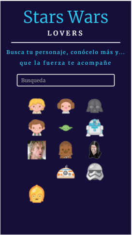

# SWAPI

* *Track:* Common Core
* *Curso:* CONSTRUYE UNA SINGLE PAGE APP (SPA) MULTI-USUARIO CONSUMIENDO DATA REMOTA
* *Unidad:* _A JUGAR CON WEB APIS _

Que la fuerza te acompañe en este ejercicio, revisa las siguientes slides para que puedas crear esta fenómenal app para los amantes de Star Wars.

¿Has visto que los sistemas operativos móviles vienen con una APP de predicción del clima? ¡Vamos a hacer la nuestra! Para ello, usaremos la API de Dark Sky y esperemos llegues a usar un API de imágenes como Flickr, Unsplash u otro. A continuación te dejamos unos slides con algunos recursos y guías del flujo de la app. Recuerda que no es necesario que sigas el diseño al pie de la letra, eres completamente libre de adaptarlo a tus gustos.

El presente reto pone a prueba nuestros conocimientos sobre *api REST y ajax*.

## Objetivo

-Se nos pide desarrollar un aplicación que contenga a los personajes de star wars, y que al darle click a cada uno de ellos, aparezca un modal brindándome más información del personaje.

## Detalles adicionales

* Dentro de nuestro repositorio encontrarás un archivo index.html el cual contiene la estructura sobre la que se realizó el reto.
* En la carpeta css un archivo main.css donde está todos los estilos aplicados y el grid que se creó para este reto. Los cuales están enlazados con mi HTML.
* En assets también se encuentra la carpeta images donde se encuentran todos las imágenes usadas para completar este reto.
* Por último el README.md explicando el contenido de nuestro repositorio.
* Dentro de la rama *gh-pages* un link donde se podrá visualizar el resultado final.

## Autor

* Gabriela Mamani Flores.
* Jennifer Carmen Sosa.